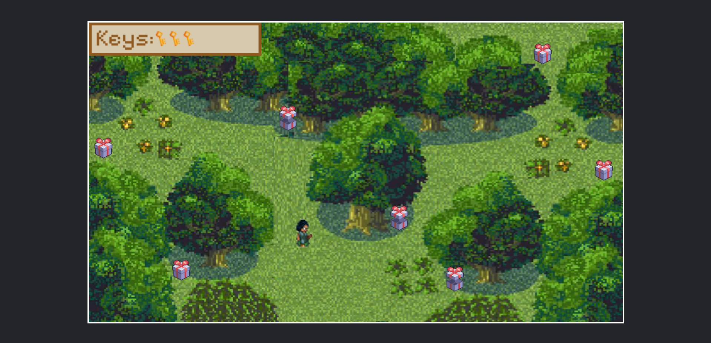

# Garden of Evo

A single-player, browser-based adventure game built in vanilla JavaScript. Built as a gift for [Evo](https://github.com/evanimenon) 🫶!

**[→ Play it here](https://shreyasirgound.github.io/Garden-of-Evo/)**

---

## about
Garden of Evo is a short browser adventure game where the player 
explores an evolving garden world. Built in one week as a creative 
JavaScript exercise focused on game state management, collision 
detection, and dynamic rendering without any external libraries.

## how to play
- Use arrow keys

## tech
Built with vanilla `JavaScript`, `HTML5 Canvas`, and `CSS` — no frameworks or game engines.

## what i learned
- Managing game loop and frame-rate with `requestAnimationFrame`
- Structuring game state without a framework
- Building interactive UX with pure DOM/Canvas APIs

## run locally
Clone the repo and open `index.html` in your browser — no build step needed.

## built by
[Shreya Sirgound](https://shreyasirgound.github.io/portfolio-site/) · Feb 2025 · 1 week
